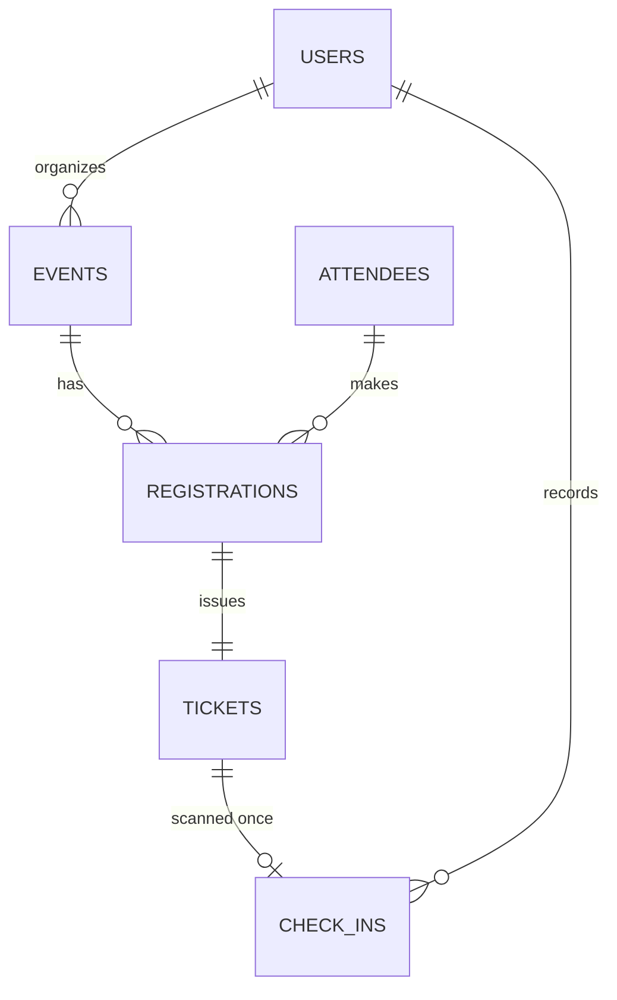

# Event Check-In System

A REST API for running the door at an event. Organizers create events and register
attendees, every registration issues a ticket with a unique code, and door staff scan that
code to check people in — **exactly once**, even when several scanners hit the same ticket
in the same millisecond.

**Stack:** Java 21 · Spring Boot 4 · Spring Data JPA · Spring Security · PostgreSQL 16 ·
Flyway · Docker · OpenAPI

---

## The problem

Check-in at small conferences and university events is usually a printed list and a pen.
That gives you no live headcount, no way to stop one ticket being used by three people, and
no record of who arrived when. This service is the smallest system that fixes all three.

## Features

- Organizer, staff and admin accounts with HTTP Basic authentication and BCrypt-hashed passwords
- Events with a capacity, a lifecycle (`DRAFT → PUBLISHED → CANCELLED`) and a check-in window
- Attendee records, kept separate from login accounts
- Registration up to capacity, with duplicate registration rejected at the database level
- One ticket per registration, carrying a random, unguessable code
- **Race-safe check-in** — concurrent scans of the same ticket produce exactly one entry
- Cancellation, which revokes the ticket and refuses if the attendee has already entered
- Live attendance stats per event
- Role-based endpoint authorization
- Interactive API docs via Swagger UI

## Architecture

Packages are organized **by feature**, not by layer:

```
com.youssef.eventcheckin
├── user/            accounts, roles, authentication details
├── event/           events and their lifecycle
├── attendee/        people who attend
├── registration/    a place at an event
├── ticket/          the scannable code
├── checkin/         door entry
└── common/          config, security helpers, exception handling
```

Each feature folder holds its own entity, repository, service, controller and DTOs. Changing
a feature means touching one folder instead of five.

Requests flow in one direction, and each layer has exactly one job:

```
Controller  →  HTTP only: status codes, request/response shapes
Service     →  business rules, transactions
Repository  →  data access (Spring Data derived queries)
Entity      →  JPA mapping to a table
DTO         →  the shape crossing the HTTP boundary — entities never leave the service
```

## Data model



| Table | Meaning |
|---|---|
| `users` | People who log in: `ADMIN`, `ORGANIZER`, `STAFF` |
| `events` | Owned by one organizer. Capacity plus a check-in window |
| `attendees` | People who attend. They never log in. Identified by email |
| `registrations` | One attendee's place at one event. Unique on `(event_id, attendee_id)` |
| `tickets` | Exactly one per registration. Holds the scannable code |
| `check_ins` | **One row per ticket, ever.** The unique constraint *is* the business rule |

The schema is owned entirely by Flyway (`src/main/resources/db/migration/`). Hibernate runs
with `ddl-auto: validate`, so it can never create or alter a table — it only verifies that
the entities match.

## Engineering notes

### The double check-in race

The interesting problem in this project. The naive implementation looks obviously correct:

```java
if (checkInRepository.existsByTicketId(ticket.getId())) {
    throw new AlreadyCheckedInException("Ticket has already been checked in");
}
checkInRepository.save(new CheckIn(...));
```

It isn't. Firing twenty simultaneous requests at one ticket code produces this in the log:

```
12:44:29.267  exec-26:  SELECT ... WHERE ticket_id = ?   → 0 rows
12:44:29.269  exec-28:  SELECT ... WHERE ticket_id = ?   → 0 rows
12:44:29.278  exec-16:  INSERT → duplicate key violates uk_check_ins_ticket_id
```

Several threads ran the existence check before any of them committed, all saw an empty
result, and all proceeded to insert.

`@Transactional` does not prevent this. PostgreSQL defaults to `READ COMMITTED`, so a
transaction sees only what other transactions have already **committed** — the competing
uncommitted insert is genuinely invisible, and the check returns an honest answer about a
stale world. A transaction gives atomicity, not exclusivity.

What actually guarantees single entry is the unique constraint on `check_ins.ticket_id`,
enforced inside the database engine where concurrent inserts serialize. The service-layer
check is a convenience that produces a friendly error on the common path; the constraint is
the guarantee.

The fix is therefore not to remove the check but to handle its failure correctly. Hibernate
flushes the insert at commit — *after* the service method returns — so a `try/catch` around
`save()` catches nothing. The `DataIntegrityViolationException` surfaces during commit and is
mapped to 409 in `GlobalExceptionHandler`, converging with the friendly path so the caller
sees one consistent answer either way.

Verified with twenty concurrent requests: **1 × 201, 19 × 409, one row in `check_ins`.**

### Other decisions worth naming

- **Attendees are not users.** They never authenticate, so giving them a password column
  would leave it null for every row. Most people attend one event and should not need an
  account to get through a door.
- **Ticket codes are random**, not derived from the primary key. Sequential codes are guessable.
- **Foreign keys reference UUIDs, not names.** A name is neither unique nor immutable, and a
  rename would have to cascade through every referencing row. Human-readable names are
  exposed in DTOs instead.
- **`check_ins` is a table, not a boolean on `tickets`.** A boolean records *whether*; a row
  records when, by whom and at which gate — and makes re-entry support a schema change
  rather than a redesign.
- **All timestamps are `TIMESTAMPTZ`** stored in UTC, mapped to `java.time.Instant`.
- **Enums persist as strings.** JPA's `ORDINAL` default silently changes the meaning of
  historical rows when an enum is reordered.
- **Cancellation is a status change, not a row deletion.** The audit trail matters; `DELETE`
  describes the caller's intent, not the SQL.

## API

Base path `/api/v1`. Authentication is HTTP Basic on every endpoint except user creation and
the docs. Interactive docs at `http://localhost:8080/swagger-ui.html`; the raw spec at
`/v3/api-docs`.

| Method | Path | Role | Purpose |
|---|---|---|---|
| POST | `/users` | public | Create an account |
| GET | `/users/me` | any | The authenticated user |
| GET | `/users/{id}` | any | User by id |
| POST | `/events` | ORGANIZER | Create a draft event |
| POST | `/events/{id}/publish` | ORGANIZER | Open the event for registration |
| GET | `/events` | any | List events (paginated) |
| GET | `/events/{id}` | any | Event detail |
| DELETE | `/events/{id}` | ORGANIZER | Cancel an event |
| GET | `/events/{id}/stats` | any | Registered, checked in, attendance rate |
| POST | `/attendees` | ORGANIZER | Create an attendee |
| GET | `/attendees` | any | List attendees (paginated) |
| GET | `/attendees/{id}` | any | Attendee by id |
| POST | `/events/{eventId}/registrations` | ORGANIZER | Register an attendee, issue a ticket |
| GET | `/events/{eventId}/registrations` | any | Registrations for an event (paginated) |
| GET | `/registrations/{id}` | any | Registration with its ticket code |
| DELETE | `/registrations/{id}` | ORGANIZER | Cancel and revoke the ticket |
| POST | `/events/{eventId}/check-ins` | ORGANIZER, STAFF | Scan a ticket code |
| GET | `/events/{eventId}/check-ins` | any | Check-in log (paginated) |

List endpoints return a Spring `Page`: the rows are in `content`, alongside `totalElements`,
`totalPages`, `number` and `size`. They accept `?page=`, `?size=` and `?sort=field,desc`.

### Errors

Every failure returns the same shape:

```json
{
  "timestamp": "2026-09-18T12:44:29.278Z",
  "status": 409,
  "error": "Conflict",
  "message": "Ticket has already been checked in",
  "fieldErrors": null
}
```

| Situation | Status |
|---|---|
| Request body fails validation (`fieldErrors` populated) | 400 |
| Missing or wrong credentials | 401 |
| Authenticated but insufficient role | 403 |
| Unknown event, registration, attendee or ticket code | 404 |
| Already checked in, event full, duplicate email | 409 |
| Event not published, outside the check-in window, invalid dates | 422 |

## Running it

**Prerequisites:** Docker, JDK 21.

```bash
git clone https://github.com/YoussefElreweny/Event-Checkin.git
cd Event-Checkin
cp .env.example .env          # then fill in the three values
docker compose up -d          # PostgreSQL on 5432
./mvnw spring-boot:run        # Flyway migrates the schema on startup
```

Health check at `http://localhost:8080/actuator/health`, docs at `/swagger-ui.html`.

The app reads its datasource and CORS origins from environment variables, so no source
change is needed to point it at a different database or frontend.

### As a container

```bash
docker build -t event-checkin .
docker run --rm -p 8080:8080 \
  -e SPRING_DATASOURCE_URL=jdbc:postgresql://host.docker.internal:5432/event_checkin \
  -e SPRING_DATASOURCE_USERNAME=eventuser \
  -e SPRING_DATASOURCE_PASSWORD=eventpass \
  event-checkin
```

A multi-stage build compiles with Maven and ships only a JRE plus the jar.

## Known limitations

Deliberate scope choices, not oversights:

- **No automated tests.** The concurrency behaviour was verified manually with parallel
  `curl`. This is the top item on the list below.
- **No ownership checks.** Roles protect endpoints but not rows, so any organizer can act on
  another organizer's events.
- **HTTP Basic, not JWT.** Credentials travel on every request and can't be scoped or
  expired. Fine for a demo; a token is the right answer for anything real.
- **Self-assigned roles.** A new account picks its own role at sign-up.
- **`event_staff` is unused.** The table exists; staff are not yet scoped to specific events.
- **N+1 queries on list endpoints.** Loading a page of registrations issues one query per row
  for the related event, attendee and ticket. Fixable with `@EntityGraph` or a batched
  second query.
- **No email delivery.** Ticket codes are returned by the API.

## Roadmap

- [ ] Integration tests with Testcontainers, including a concurrent check-in test
- [ ] Fix the N+1 queries
- [ ] Ownership and event-staff authorization
- [ ] JWT with refresh tokens
- [ ] QR generation and a scanner UI
- [ ] Public self-registration page with rate limiting
- [ ] GitHub Actions CI and a deployment